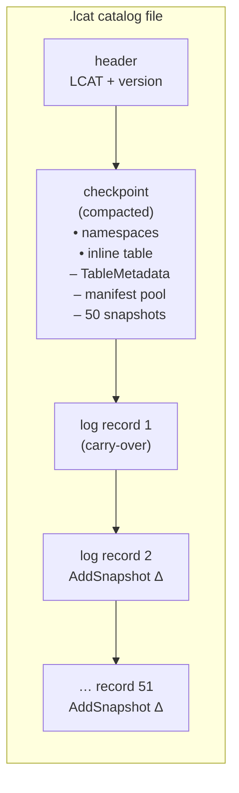
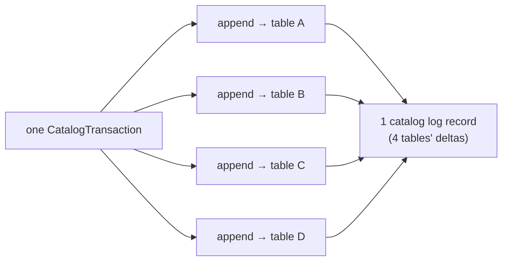

# Catalog-format footprint samples

Worked, measured examples of what inlining buys the fileio-catalog versus vanilla
Iceberg. Each example replays **one seeded workload under four catalog modes** and
records the byte-exact footprint each mode wrote:

| mode | inline TM | inline ML | gzip JSON | what it stores |
|---|---|---|---|---|
| **`orig`** | – | – | – | vanilla / pointer mode: external `metadata.json` + `snap-*.avro` per commit |
| **`orig-gz`** | – | – | ✓ | vanilla with Iceberg's native `write.metadata.compression-codec=gzip` (the fair baseline; uncompressed `orig` is Iceberg's default) |
| **`tm`** | ✓ | – | – | table metadata inlined into the catalog; manifest lists stay external |
| **`tmml`** | ✓ | ✓ | – | table metadata **and** manifest lists inlined; no catalog-layer sidecars |

(`inline TM` = `fileio.catalog.inline`, `inline ML` = `fileio.catalog.inline.manifests`.)
Because the same workload (same snapshots, manifests, data-file references) is
replayed under all four modes, the catalog representation is the only variable —
every footprint difference is attributable to inlining alone.

## What "footprint" means here

We measure the **catalog layer**: the catalog file itself (`.lcat`), the
`metadata.json` files, and the manifest lists (`snap-*.avro`). We deliberately
exclude the **data layer** — the manifest `.avro` files and the Parquet data
files — because it is identical across all four modes (inlining changes how the
catalog points at manifests, not the manifests or data themselves). The data
layer dominates total storage in any real table; the catalog layer is the part
inlining can shrink.

The samples themselves are **not checked in** — regenerate them from a seed (see
[Regenerating](#regenerating)). The exact tables and figures land in
`figures/<seed>/REPORT.md`. As a sense of scale, a representative run (seed
`0xC0FFEE`) shrinks the catalog-layer footprint of the `1tbl-50x50` example from
~5 MB across 202 files (vanilla) — or ~1.3 MB gzipped — to ~38 KB in a **single**
file under `tmml`; `ml-carry-forward` collapses from ~18 MB to ~80 KB. Numbers
vary modestly with the seed; the report has the exact figures for your run.

## The examples

Four scenarios, described in detail below:

- **1tbl-50x50** — headline. One table, a 50-snapshot checkpoint + 50 appended updates.
- **multi-table-atomic** — four tables updated in one atomic commit.
- **many-tables** — 256 tables, catalog-scale per-table overhead.
- **ml-carry-forward** — a long append chain isolating manifest-pool dedup.

`1tbl-50x50` is a clean controlled experiment, but on its own it understates two
things: the multi-table-atomic commit (vanilla can't express it at all) and the
catalog scaling story (one table hides per-table overhead). The other three cover
those, and `ml-carry-forward` isolates the single largest source of vanilla waste
(the quadratic manifest-list rewrite) so the pool-dedup win is unmistakable.

## 1tbl-50x50 — one table, 50 + 50 commits

One table. **50 snapshots** compacted into the checkpoint, then **50 update
transactions** appended to the log. The workload is append-biased but also removes
manifests (overwrite/delete) with net row growth, so the manifest pool churns the
way a real table's does. The same sequence is replayed under all four modes.

This is the controlled experiment: identical snapshots, manifests, and data-file
references across `orig`/`orig-gz`/`tm`/`tmml`. The only thing that changes is how
the catalog stores table metadata and manifest lists.

### What each mode writes per commit

```
orig  (vanilla / pointer)      tm  (inline TM)             tmml (inline TM+ML)
─────────────────────────      ─────────────────────       ──────────────────────
metadata.json   (full rewrite) ── inlined as delta ──┐      ── inlined as delta ──┐
snap-*.avro     (full rewrite) snap-*.avro (rewrite)  │      ── inlined in pool ──┤
manifest .avro  (1 new)        manifest .avro (1 new) │      manifest .avro (1 new)│
catalog pointer swap           catalog append record ◀┘      catalog append record◀┘
```

(`orig-gz` writes the same files as `orig`, with the `metadata.json` gzip-compressed.)
`orig` rewrites the **entire** table metadata (growing with snapshot history) and
the **entire** manifest list (growing with live-manifest count) on every commit.
`tm` replaces the metadata.json rewrite with a small delta record inside the
catalog file. `tmml` additionally folds the manifest list into a per-table
manifest pool, so carried-forward manifests cost zero new bytes.

### Catalog file structure (tmml)



The checkpoint holds the compacted state of the first 50 snapshots — table
metadata, the manifest pool, and per-snapshot manifest index lists. Each
subsequent commit appends one small delta record (`AddSnapshot` + `SetSnapshotRef`,
plus an `AddManifest`/`RemoveManifest` for the pool under `tmml`).

### Where the gains come from

1. **Eliminating `metadata.json` rewrites (TM inlining).** `orig` rewrites the
   full table metadata on every commit; as snapshot history grows, so does each
   rewrite, and 101 of them accumulate. `tm` and `tmml` carry one ~0.35 KB delta
   record per commit instead. This is the largest single win.
2. **Eliminating `snap-*.avro` rewrites (ML inlining).** `orig` and `tm` rewrite
   the full manifest list every commit. `tmml` stores each manifest once in the
   pool; the only per-commit cost is the index entry for the new manifest.
3. **Pool dedup of carried-forward manifests.** The catalog file grows only
   modestly from `tm` to `tmml` even though it absorbs the entire manifest-list
   history — because consecutive snapshots share all but one manifest.

The per-commit append-log records (the per-commit figure in the regenerated
report) show the steady-state cost: a flat ~0.35–0.39 KB per commit, with
occasional larger records for the overwrite/delete commits that carry both a
remove and an add against the pool.

## multi-table-atomic — four tables, one commit

Four tables updated **together**. Each update transaction is a single atomic
`CatalogTransaction` that appends to all four tables at once — the multi-table
commit vanilla Iceberg cannot express. Ten such transactions are compacted into
the checkpoint; twenty more are appended to the log.



- **One write, four tables.** Under `tmml` each atomic transaction is a *single*
  append-log record (~1.5 KB) carrying all four tables' snapshot deltas. Vanilla
  Iceberg would need four independent table commits, each rewriting that table's
  `metadata.json` and `snap-*.avro` — and with no way to make the four atomic.
- **The footprint difference is the same inlining story as the single-table case**
  (no `metadata.json`, no `snap-*.avro` under `tmml`), now multiplied across the
  four tables touched per transaction.

The atomic-commit capability is the qualitative win here; the byte footprint (in
the report) is the quantitative one.

## many-tables — catalog scale

256 tables, one append each, all compacted into the checkpoint (no append log).
This isolates how **per-table state** scales the catalog, independent of
per-commit deltas: the entire footprint is the compacted checkpoint plus the
external files each mode keeps.

- **`orig`** keeps 256 external `metadata.json` files (one current version per
  table, plus the create-time version) and 256 `snap-*.avro` manifest lists. The
  catalog file itself is small — it only stores pointers.
- **`tm`** moves all 256 tables' metadata *into* the checkpoint. The catalog file
  grows accordingly, but the structural codec stores 256 small, similar table
  metadatas compactly — and the 256 `metadata.json` files disappear. The manifest
  lists stay external.
- **`tmml`** additionally inlines the manifest lists, dropping the 256
  `snap-*.avro` files. The whole catalog is one file.

This example is the counterpoint to `ml-carry-forward`: there the win is per-commit
history; here it is the per-table multiplier across a wide catalog. Per-table
metadata is small, so `tm`'s win over `orig` is more modest than in the
single-table histories — the decisive drop is `tmml` shedding the manifest lists.

## ml-carry-forward — the quadratic manifest-list rewrite

One table, 200 pure `FastAppend` commits, no removals. This isolates the single
largest source of vanilla waste: the **manifest list is rewritten in full on every
commit**, so by commit *n* it lists *n* manifests, and the total bytes written
across the run grow as O(n²). The same is true of the table metadata, whose
snapshot history grows with every commit.

```
commit 1:   [m1]
commit 2:   [m1, m2]                 ← rewrites m1's entry again
commit 3:   [m1, m2, m3]             ← rewrites m1, m2 again
…
commit 200: [m1, m2, …, m200]        ← rewrites 199 carried-forward entries
```

- **`orig`** pays the quadratic cost twice: in `metadata.json` (growing snapshot
  history rewritten each commit) and in `snap-*.avro` (growing manifest list
  rewritten each commit). This is the largest catalog-layer footprint of any
  example here, by far.
- **`tm`** removes the metadata.json quadratic (one small delta record per commit)
  but still rewrites the full manifest list externally.
- **`tmml`** removes both. Each manifest is written once into the pool; every
  subsequent snapshot that carries it forward references it by index at **zero new
  bytes**. The per-commit cost is a single pool index entry plus the snapshot
  delta — flat, not growing.

This is where the docs' "~50× manifest-pool compression" claim becomes visible:
the catalog-layer footprint collapses from megabytes to tens of kilobytes.

## Examples worth adding later (not yet generated)

- **Pointer-mode fallback at the 4 MiB budget** — a table whose inline metadata
  exceeds the append budget, forcing the format back to an external pointer.
- **Committed-txn dedup-set growth** — how the checkpoint's committed-transaction
  set grows with commit rate and the retention window (`committed.retention.ms`).
- **Concurrent-writer CAS-conflict retry** — footprint and write amplification when
  writers race and retry.
- **Schema / partition-spec churn (DDL-heavy)** — where delta mode degrades because
  each commit carries large schema/spec updates rather than a small `AddSnapshot`.

## Regenerating

One seed drives all four examples. Pass it to the generator script:

```bash
docs/sample/gen.sh 0xC0FFEE        # decimal or 0x-hex
```

This builds the byte-exact artifacts, renders the figures, and writes the report
under `docs/sample/figures/<seed>/` (git-ignored):

```
docs/sample/figures/<seed>/
  <example>/<mode>/files/...        byte-exact catalog artifacts
  <example>/{manifest.json,sizes.csv,config.json}
  figures/<example>_{footprint,per-commit}.png
  figures/all-examples_footprint.png
  REPORT.md                          tables + figures for all examples
```

Under the hood the script runs the generator and then the analysis; either can be
run directly:

```bash
mvn test-compile exec:java \
  -Dexec.mainClass=org.apache.iceberg.io.sample.SampleGenerator \
  -Dexec.classpathScope=test \
  -Dexec.args="--seed 0xC0FFEE --out docs/sample/figures/0xC0FFEE"   # add --scenario <name> to limit
python3 docs/sample/analyze.py --root docs/sample/figures/0xC0FFEE
```

The generator and analysis live at
`src/test/java/org/apache/iceberg/io/sample/` and `docs/sample/analyze.py`.

### Determinism

The master seed fixes the op sequence and every data-file spec, so all measured
**byte sizes** are reproducible for a given seed. Exact bytes are **not**: the
live Iceberg commit path stamps random snapshot IDs and wall-clock timestamps into
metadata, so a regeneration reproduces the sizes (to within a few bytes) but not
byte-identical files. A regenerated `.lcat` is a real catalog file you can drop
into [`../format-explorer/`](../format-explorer/) for byte-level inspection.

### A note on the append log

Each example compacts its setup transactions into the checkpoint via CAS, then
appends the update transactions as log records. The append log always carries one
extra **carry-over record** beyond the update count: a CAS compaction folds its
changes into the checkpoint but still records its own transaction id (for dedup),
so the commit that produced the checkpoint leaves a single trailing record. This
is genuine format behavior, not an artifact of the generator.
